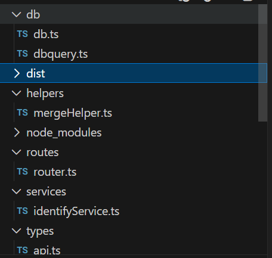
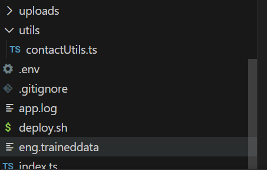
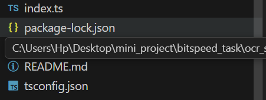
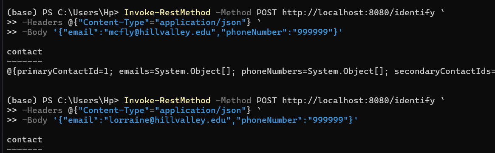
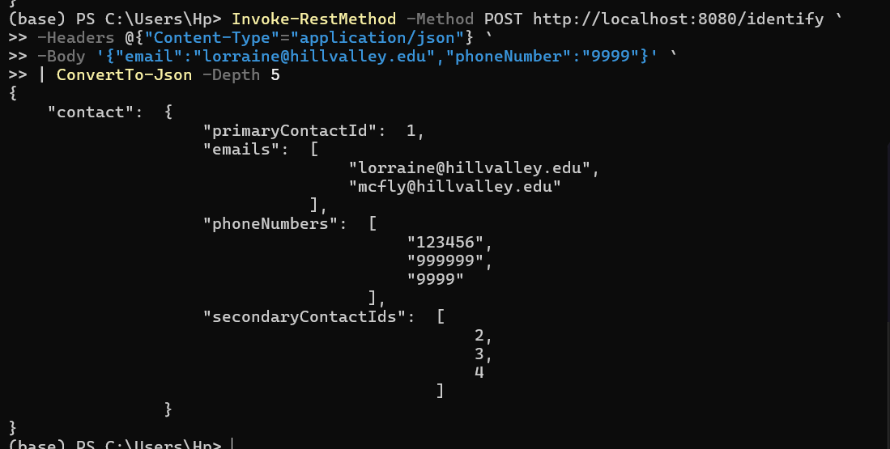
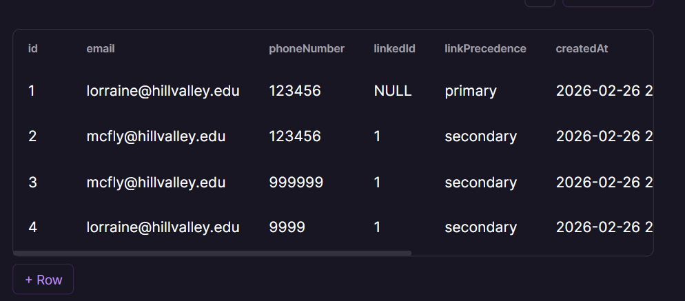

# Identity Reconciliation Service

A backend service that identifies and links customer contact information (email & phone number) into a unified identity cluster using primary and secondary contacts.

This project is built using:

- Node.js (Express)
- TypeScript (Minimal)
- MySQL (Railway)
- No ORM (Raw Queries via "mysql2/promise")

---

## 🚀 Problem Statement

Customers may interact with the system using:

- Different emails
- Different phone numbers

Over time, multiple entries may exist for the same real person.

This service:

- Creates a Primary Contact
- Links related future contacts as Secondary Contacts
- Merges clusters if two existing primaries are later found to be related

---

🧠 Core Logic

Each contact record has:

- Field| Description
- id| Unique Contact ID
- email| Email (nullable)
- phoneNumber| Phone (nullable)
- linkedId| Points to Primary Contact
- linkPrecedence| primary / secondary
- createdAt| Timestamp
- updatedAt| Timestamp
- deletedAt| Soft delete

Rules:

- First time email/phone → create Primary
- New email with same phone → create Secondary
- New phone with same email → create Secondary
- If both email & phone already exist → No new row
- If two primaries are found related → Merge clusters

---

## 🗂️ Project Structure

src/
├── db/
│   ├── db.ts
│   └── contact.query.ts
├── routes/
│   ├── router.ts
│   └── identify.route.ts
├── services/
│   └── identify.service.ts
├── utils/
│   └── contact.utils.ts
├── helpers/
│   └── merge.helper.ts
├── types/
│   └── identify.types.ts
└── index.ts

---

## 🛠️ Setup Instructions

### 1️⃣ Install Dependencies

npm install

---

### 2️⃣ Environment Variables

Create ".env" file:

- PORT=8080
- sqlDB_HOST=your_host
- sqlDB_USER=your_user
- sqlDB_PASS=your_password
- sqlDB_NAME=railway
- sqlDB_port=your_port

---

### 3️⃣ Create Database Table

Run this SQL on Railway MySQL:

CREATE TABLE Contact (
  id INT AUTO_INCREMENT PRIMARY KEY,
  email VARCHAR(255),
  phoneNumber VARCHAR(20),
  linkedId INT,
  linkPrecedence ENUM('primary','secondary'),
  createdAt DATETIME,
  updatedAt DATETIME,
  deletedAt DATETIME
);

---
## Architecture, Flow Diagrams and some results

### 4️⃣ Run Locally

npm run dev

- Server starts at:
- http://localhost:8080
- use deploy.sh too

## 📡 API Endpoint

### POST "/identify"

### Request Body

{
  "email": "example@test.com",
  "phoneNumber": "123456"
}

Either "email" or "phoneNumber" is required.

---

### Response

{
  "contact": {
    "primaryContactId": 1,
    "emails": [
      "example@test.com",
      "other@test.com"
    ],
    "phoneNumbers": [
      "123456",
      "999999"
    ],
    "secondaryContactIds": [2,3]
  }
}

---

### 🧪 Testing (PowerShell)

Invoke-RestMethod -Method POST http://localhost:8080/identify `
-Headers @{"Content-Type"="application/json"} `
-Body '{"email":"test@abc.com","phoneNumber":"123456"}' `
| ConvertTo-Json -Depth 5

---

### ☁️ Deployment

- Database:Railway MySQL
- Backend:Render Node Service

Update production URL and test using:

POST https://your-app.up.railway.app/identify

---

### ✅ Expected Behaviour Summary

- New unique contact → Primary created
- Matching phone/email → Secondary created
- Matching both → No new contact
- Multiple primaries detected → Oldest retained, others linked

---

### 📌 Notes

- Uses raw SQL (no ORM)
- ENUM used for strict precedence control
- Soft delete supported via "deletedAt"

---

### 👨‍💻 Author

Submission for Identity Reconciliation Backend Assignment.

